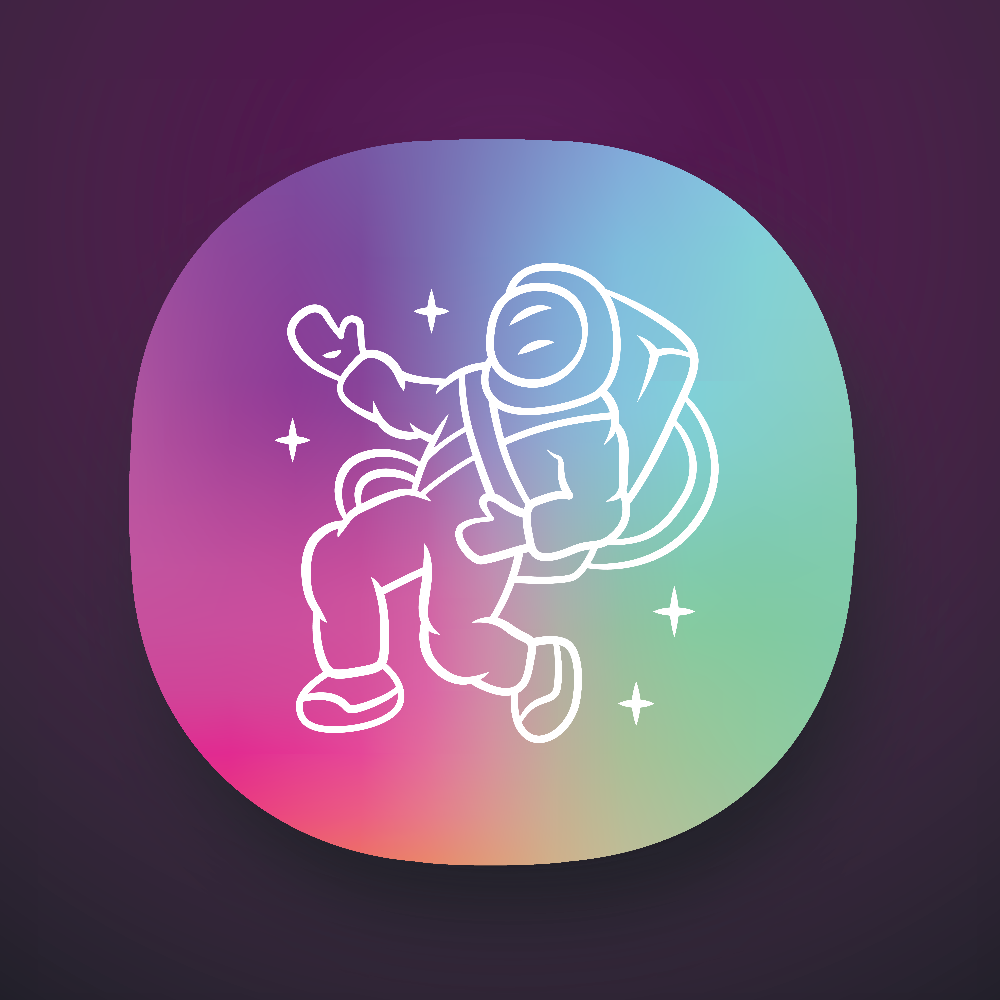

<!-- PROJECT SHIELDS -->
<!--
*** I'm using markdown "reference style" links for readability.
*** Reference links are enclosed in brackets [ ] instead of parentheses ( ).
*** See the bottom of this document for the declaration of the reference variables
*** for contributors-url, forks-url, etc. This is an optional, concise syntax you may use.
*** https://www.markdownguide.org/basic-syntax/#reference-style-links
-->
[![Contributors][contributors-shield]][contributors-url]
[![Stargazers][stars-shield]][stars-url]
[![Issues][issues-shield]][issues-url]
[![GPL-3.0][license-shield]][license-url]

<!-- PROJECT LOGO -->
 

  

  <h3 align="center">Celes</h3>

<!-- TABLE OF CONTENTS -->

  
Table of Contents

  <ol>
    <li>
      <a href="#about-the-project">About The Project</a>
      <ul>
        <li><a href="#built-with">Built With</a></li>
      </ul>
    </li>
    <li>
      <a href="#getting-started">Getting Started</a>
      <ul>
        <li><a href="#prerequisites">Prerequisites</a></li>
        <li><a href="#installation">Installation</a></li>
      </ul>
    </li>
    <li><a href="#usage">Usage</a></li>
    <li><a href="#roadmap">Roadmap</a></li>
    <li><a href="#contributing">Contributing</a></li>
    <li><a href="#license">License</a></li>
    <li><a href="#contact">Contact</a></li>
    <li><a href="#acknowledgments">Acknowledgments</a></li>
  </ol>

<!-- ABOUT THE PROJECT -->
## About The Project

<!-- [![Product Name Screen Shot][product-screenshot]](https://example.com) -->

As an astronaut with the mission to find the missing pieces for a better life on mars you have to survive with the harsh realisation of suffering for doing so.
The only way to survive is to be eaten by your only real savior, your suit. Hereby you will lose something you are dear for (bodyparts), every few time you are to long on the planet. While you are hurting and losing the most important parts of who you are, you have to fight monsters and escape from this hell.

If you want to replenish you're life you have to find portals to survive. Every portal takes you back into time were you are teleported somewhere on mars. The goal is to find the missing materials to leave the planet.

<a href="#readme-top">🔝</a>

### Built With

[![C++][C++]][C++]
[![SDL2][SDL2]][SDL2-url]
[![OPENGL][OPENGL]][OPENGL-url]
[![FREEIMAGE][FREEIMAGE]][FREEIMAGE-url]

<a href="#readme-top">🔝</a>

<!-- GETTING STARTED -->
## Getting Started

### Installation

<a href="#readme-top">🔝</a>

<!-- SCREENSHOTS -->
## Screenshots

<a href="#readme-top">🔝</a>

<!-- LICENSE -->
## License

Distributed under the GPL-3.0 License. See [`LICENSE`](/LICENSE) for more information.

<a href="#readme-top">🔝</a>

<!-- ACKNOWLEDGMENTS -->
## Acknowledgments

<!-- Use this space to list resources you find helpful and would like to give credit to. -->

<a href="#readme-top">🔝</a>

<!-- MARKDOWN LINKS & IMAGES -->
<!-- https://www.markdownguide.org/basic-syntax/#reference-style-links -->
[contributors-shield]: https://img.shields.io/github/contributors/ravonnn/buas-intake.svg?style=for-the-badge
[contributors-url]: https://github.comravonnn/buas-intake/graphs/contributors
[stars-shield]: https://img.shields.io/github/stars/ravonnn/buas-intake.svg?style=for-the-badge
[stars-url]: https://github.com/ravonnn/buas-intake/stargazers
[issues-shield]: https://img.shields.io/github/issues/ravonnn/buas-intake.svg?style=for-the-badge
[issues-url]: https://github.com/ravonnn/buas-intake/issues
[license-shield]: https://img.shields.io/github/license/ravonnn/buas-intake.svg?style=for-the-badge
[license-url]: https://github.com/ravonnn/buas-intake/blob/master/LICENSE.txt
[product-screenshot]: github/screenshot.png
[C++]: https://img.shields.io/badge/C++-00599C?style=for-the-badge&logo=C%2B%2B&logoColor=white
[C++-url]: https://cplusplus.com/
[SDL2]: https://img.shields.io/badge/-SDL2-lightgrey?style=for-the-badge
[SDL2-url]: https://www.libsdl.org/
[OPENGL]: https://img.shields.io/badge/OpenGL-informational?style=for-the-badge&logo=opengl&logoColor=white&color=2bbc8a
[OPENGL-url]: https://www.opengl.org/
[FREEIMAGE]: https://img.shields.io/badge/-FreeImage-lightgrey?style=for-the-badge
[FREEIMAGE-url]: https://angular.io/
